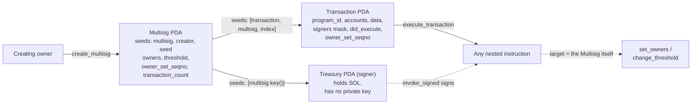
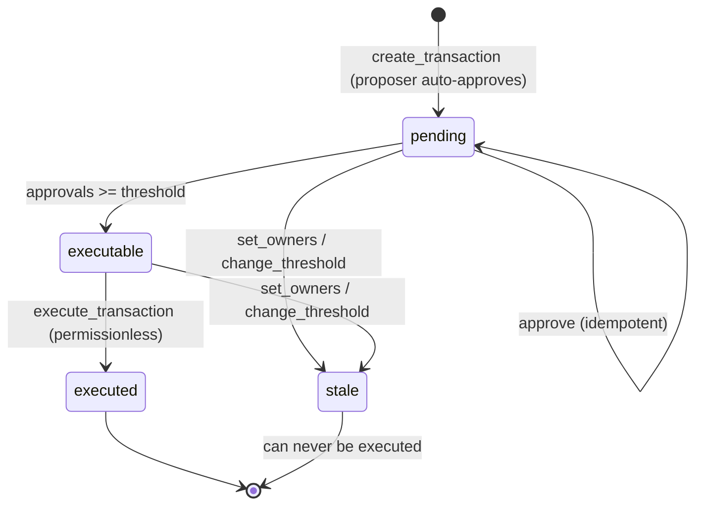

# magican-solana-multisig

A general-purpose programmable multisig wallet on Solana: a PDA treasury that executes **any**
nested instruction once **M of N** owners have approved it.

Unlike SPL Multisig, which only handles token operations, a proposal here stores an arbitrary
`program_id` + account metadata + instruction data, and the program signs for its own treasury via
`invoke_signed`. Governance (owner set, threshold) goes through the very same path — a proposal the
multisig executes against itself.

**Program ID (devnet):** [`EKYNZ8yeiivzgpmbq5TxC5bphmRnfARLxgzMxDUhHEUG`](https://explorer.solana.com/address/EKYNZ8yeiivzgpmbq5TxC5bphmRnfARLxgzMxDUhHEUG?cluster=devnet)

Stack: Anchor v1 · Rust 1.89 · LiteSVM · Codama · Next.js 16 · `@solana/kit` 7 · framework-kit
(`@solana/client` + `@solana/react-hooks`) · Playwright.

---

## What's non-trivial here

**The treasury is separate from the state.** The multisig's data and its money live in different
PDAs: `Multisig` (owners, threshold, counters) and a treasury PDA seeded with `[multisig.key()]`
that has no private key. Only the program itself can sign for the treasury. That is also what makes
self-governance work: the `Auth` context declares the treasury PDA as a `Signer`, so
`set_owners`/`change_threshold` are physically impossible to call directly — only from inside
`execute_transaction`.

**Proposal addresses are deterministic.** The `Transaction` PDA derives from `[b"transaction",
multisig, index]`, where `index` is the multisig's counter. No client-side keypairs: any
participant derives a proposal's address from on-chain state alone. One side effect the UI had to
absorb: the index lives only in the seeds, so the frontend rebuilds the "address → number" mapping
by deriving PDAs.

**A vote is a boolean mask, not a counter.** A repeated `approve` is idempotent — it cannot inflate
the quorum. The mask is frozen against the owner set the proposal was created under, and any change
to the rules bumps `owner_set_seqno`, invalidating older approvals.

**What is approved is exactly what executes.** Account privileges come from what the proposal
stores on-chain, not from the form used to create it. `execute` never elevates roles beyond what is
needed: the signer privilege goes to the treasury only, and only inside the CPI.

**Simulation before signature.** The UI builds the message, serialises it **unsigned** (no wallet
popup) and runs it through `simulateTransaction`; the sign button unlocks only on success. Note
that a successful RPC response ≠ a successful transaction — an execution failure arrives in
`value.err`, and without checking it the dry run would say "safe to send" precisely when the
transaction is doomed.

**Refusals are explained up front, and honestly.** The client mirrors the program's checks so a
user learns about a refusal before signing rather than from a simulation error. The stated reason
has to be the real one: collapsing "already executed" and "rules changed" into a generic "waiting
for quorum" would send someone off to wait for signatures on a dead proposal.

---

## Account architecture



The key detail is that last arrow: governance instructions are ordinary proposals whose target is
the multisig itself. There is no separate "admin" path.

## Proposal lifecycle



`executed` and `stale` are terminal: there is deliberately no `cancel` in the program, so an
unexecutable proposal stays in the list forever. Hence the requirement on the client — never create
a proposal that is doomed to fail (rent-rule violations, a foreign signer).

---

## Quick start

### On-chain program

```bash
NO_DNA=1 anchor build                  # produces the IDL + target/deploy/*.so
cargo test -p magican-solana-multisig  # LiteSVM tests against the built .so
```

Order matters: the tests pull in the `.so` via `include_bytes!`, so `anchor build` has to come
first. The `NO_DNA=1` prefix is a quirk of the local development environment.

### Client (Codama)

```bash
npm run generate:client   # clients/js/src/generated from the IDL
npm run demo:local        # spins up solana-test-validator and runs demo.ts
```

`demo.ts` walks through two scenarios: the 2-of-3 happy path (create → propose → approve → execute)
and the negative one — with M−1 approvals `execute` fails with `NotEnoughSigners` (6005).

The script targets a local validator: it hands participants 16 SOL, which no devnet faucet will
ever grant. The proof that this works against **real** devnet is not this script but the Playwright
specs in `app/e2e` (see below).

### Frontend

```bash
cd app
npm install
npm run dev               # http://localhost:3000, network: devnet
```

Any Wallet-Standard wallet works (tested with Phantom on devnet). Test SOL:
`solana airdrop 1 -u devnet`.

---

## Tests

| What | With | Count |
|---|---|---|
| Program | LiteSVM (Rust) | 22 |
| Frontend: modules and components | Vitest (+ jsdom, Testing Library) | 120 |
| Full flow against real devnet | Playwright | 2 |

```bash
cargo test -p magican-solana-multisig   # program
cd app && npx vitest run                # modules + components
cd app && npx tsc --noEmit && npm run build
cd app && npx playwright test           # needs a running npm run dev
```

The e2e specs run **against real devnet** with stand-in wallets: signing is delegated to Node, keys
never reach the browser, and the application code executing is the real thing. This turned out not
to be a luxury — three defects (a multisig missing from the list, a frozen treasury balance, a lost
approval) were invisible to unit tests **by their very nature**: they live at the seam with the
network. A public RPC is a load balancer, and a write confirmed by one node is not visible to a
read served by another. The cure has two layers: a subscription where one exists (the treasury
balance, over WebSocket), and re-reading until the expected state appears where none does
(`app/src/lib/rpc-lag.ts`).

---

## Security model

The program was written against an explicit list of attack vectors, and **each one** has a negative
test that expects a specific error (`programs/magican-solana-multisig/tests/security.rs`):

| # | Vector | Defence |
|---|---|---|
| 1 | A non-owner creates or approves a proposal | `NotAnOwner` |
| 2 | Execution with too few approvals | mask recount against `threshold` |
| 3 | Repeated execution (replay) | `did_execute` |
| 4 | One owner voting twice | a mask, not a counter — idempotent |
| 5 | Executing a proposal after the rules changed | `owner_set_seqno` |
| 6 | Calling governance directly, bypassing the quorum | treasury PDA as `Signer` in `Auth` |
| 7 | Re-initialising an existing multisig | `init` (not `init_if_needed`) |
| 8 | Substituting a PDA with a non-canonical bump | stored canonical bump + `ConstraintSeeds` |
| 9 | Threshold of 0 or above the owner count | `InvalidThreshold` on create and change |
| 10 | Duplicate owners | `DuplicateOwner` on create and `set_owners` |
| 11 | Privilege escalation through CPI | privileges strictly from the stored metadata |

Plus: checked arithmetic with `overflow-checks = true`, typed `Account<>` wrappers (owner and
discriminator validated automatically), and clamping the threshold down when the owner list shrinks.

### Deliberate trade-offs

The design was cross-checked against the audited `coral-xyz/multisig` (its ancestor) and Squads
Protocol v4 (the maturity benchmark). Some findings are closed, others were left open on purpose —
and that deserves to be said out loud rather than quietly omitted:

- **Closed:** `change_threshold` also bumps `owner_set_seqno`. Otherwise lowering the threshold
  would make an under-approved proposal suddenly executable without re-approval under the new rule.
- **Left open, deliberately:** there is no allowlist of callable programs and no full Anchor
  validation on `remaining_accounts` — a general-purpose wallet is general-purpose for a reason;
  vector #11 is covered by the runtime.
- **Left open, deliberately:** there is no check that the target program was not upgraded between
  a proposal's creation and its execution. Squads addresses this with a UI warning and an optional
  high-security mode rather than a hard on-chain check; the same trade-off is taken here.
- **Left open, deliberately:** there is no expiry — an approved proposal stays executable
  indefinitely until the rules change. Partially covered by `owner_set_seqno`, fully only by a timer.

This is a learning/portfolio project: it demonstrates security thinking, but it has not been
externally audited. Use Squads for real funds.

---

## Layout

```
programs/magican-solana-multisig/   the program (Anchor): state, error, instructions/*
  tests/                            LiteSVM tests, including security.rs
clients/js/src/generated/           Codama client generated from the IDL
scripts/                            client generation, demo.ts against a validator
app/                                frontend (Next.js App Router)
  src/lib/                          pure logic: PDAs, instructions, statuses, errors
  src/hooks/                        reading state from the network
  src/components/                   UI + component tests
  e2e/                              Playwright against devnet
```

The split is deliberate: everything verifiable without a network and without a DOM lives in
`src/lib` and is covered by ordinary tests, which keeps the components thin.

---

## Licence

MIT © 2026 [@magicanscript](https://github.com/magicanscript)
